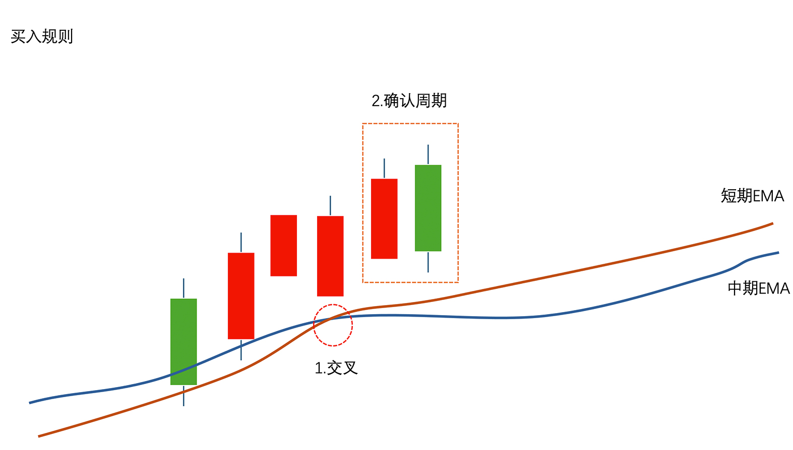
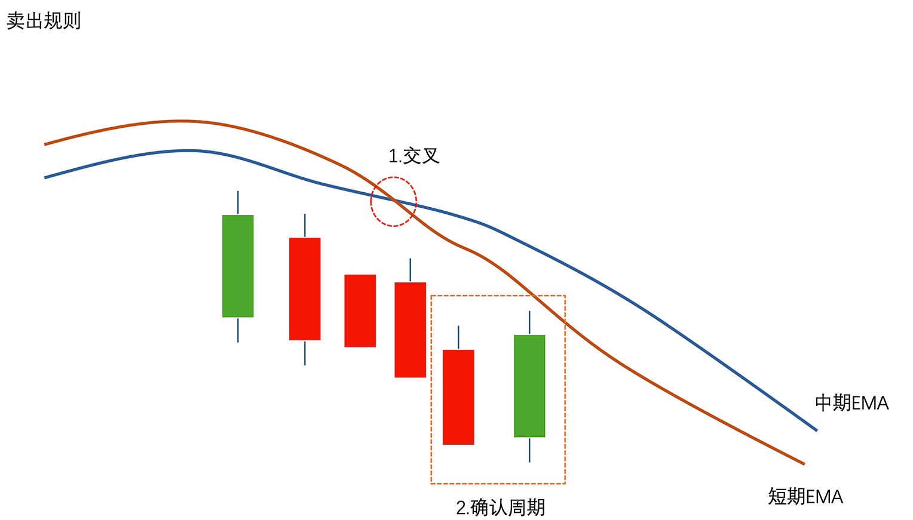

# <center>外汇短期价格确认的移动平均线交叉策略</center>
#### <p style="text-align: right">2025-05-25</p>

>***免责声明 以下所有内容仅供教育和信息参考，不构成任何投资建议。 算法交易和金融市场投资涉及重大风险，可能导致资金损失。您应自行承担所有投资决策的风险。在进行任何交易前，请务必进行独立研究并咨询专业的财务顾问。*** 

今天，我们来一起实现一个经典的带有价格确认的移动平均线交叉策略 (Moving Average Crossover)，并看看它在短线交易中的表现。

该策略旨在捕捉外汇市场在短期内的短期趋势。它使用较短周期的移动平均线来识别入场时机，并结合价格行为确认来提高信号的质量，减少噪音影响。

<a href="https://github.com/algotradinggoldmine/AlgoTradingGoldmine/blob/main/docs/strategies/forex_ma_crossover_v1.00.00/forex_ma_crossover_v1.00.00.py" target="_blank">代码文件</a>


## 交易规则 :
### 开仓规则：
为了迅速捕捉信号，本示例开仓使用5分钟EMA，短期为6，中期为24，确认为2根K线。（这些参数可以根据自身需要进行调整）
#### 做多：
  当短期 EMA 上穿中期 EMA，我们视为潜在做多信号，等待进行价格确认，如果接下来2根K线收盘价均在短期EMA之上则开仓做多。</br>
  

#### 做空：
  当短期 EMA 下穿中期 EMA，我们视为潜在做空信号，等待进行价格确认，如果接下来2根K线收盘价均在短期EMA之下则开仓做空。</br>
  

### 平仓规则：
留出一定持仓时间，本示例平仓使用1小时EMA，短期为4，中期为24，无确认。（这些参数可以根据自身需要进行调整）

#### 当持有多单时：
1. 如果获利超过设定值(600 USD)，立即平仓
2. 如果短期 EMA 下穿中期 EMA，即出现潜在做空信号时，立即平仓

#### 当持有空单时：
1. 如果获利超过设定值(600 USD)，立即平仓
2. 如果短期 EMA 上穿中期 EMA，即出现潜在做多信号时，立即平仓


## 主要代码： 
   ### 识别信号和价格确认
```python
    def forex_intraday_ma_crossover_with_confirmation(self, timeframe, short_window, medium_window, confirmation_window, op):
        """
        适用于外汇周内交易的价格确认的移动平均线交叉策略。
        Forex intraday Moving Average crossover strategy with price confirmation.

        Args:
            timeframe: time frame (时间框架)
            short_window (int): 短期 EMA 周期。
                                Short-term EMA period.
            medium_window (int): 中期 EMA 周期。
                                 Medium-term EMA period.
            confirmation_window (int): 价格确认周期。
                                       Price confirmation period.

        Returns:
            signal: 当op=='open'时，返回buy或sell，当op=='close'时，返回close_long或close_short，如果返回空则无信号
                    When op=='open', returns 'buy' or 'sell'; when op=='close', returns 'close_long' or 'close_short'. Returns empty string if no signal.
        """
        max_bars = medium_window + 24 # Maximum bars needed for calculations (计算所需的最大K线数量)
        sd_h1 = GetSymbolData(Symbol(), timeframe=timeframe, size=max_bars) # Get symbol data (获取交易品种数据)
        signal = '' # Initialize signal (初始化信号)
        # Calculate EMAs for crossover detection with shifts (计算用于交叉检测的EMA并考虑偏移量)
        short_ema_1 = iMA(sd_h1.close, timeperiod=short_window, matype=EMA, shift=confirmation_window + 1)
        medium_ema_1 = iMA(sd_h1.close, timeperiod=medium_window, matype=EMA, shift=confirmation_window + 1)
        short_ema_2 = iMA(sd_h1.close, timeperiod=short_window, matype=EMA, shift=confirmation_window + 2)
        medium_ema_2 = iMA(sd_h1.close, timeperiod=medium_window, matype=EMA, shift=confirmation_window + 2)

        if op == 'close':
            # 卖出平多逻辑 (Logic for closing long positions)
            if short_ema_1 < medium_ema_1 and short_ema_2 >= medium_ema_2:
                signal = 'close_long'
            # 买入平空逻辑 (Logic for closing short positions)
            elif short_ema_1 > medium_ema_1 and short_ema_2 <= medium_ema_2:
                signal = 'close_short'
        else:
            # 买入逻辑 (Buy logic)
            if short_ema_1 > medium_ema_1 and short_ema_2 <= medium_ema_2:
                # 检查价格确认 (Check price confirmation)
                confirmed = True
                for j in range(0, confirmation_window):
                    short_ema = iMA(sd_h1.close, timeperiod=short_window, matype=EMA, shift=confirmation_window-j)
                    if sd_h1.close[confirmation_window-j] < short_ema: # If close price is below short EMA, not confirmed (如果收盘价低于短期EMA，则未确认)
                        confirmed = False
                        break
                if confirmed:
                    signal = 'buy'

            # 卖出逻辑 (Sell logic)
            elif short_ema_1 < medium_ema_1 and short_ema_2 >= medium_ema_2:
                # 检查价格确认 (Check price confirmation)
                confirmed = True
                for j in range(0, confirmation_window):
                    short_ema = iMA(sd_h1.close, timeperiod=short_window, matype=EMA, shift=confirmation_window-j)
                    if sd_h1.close[confirmation_window-j] > short_ema: # If close price is above short EMA, not confirmed (如果收盘价高于短期EMA，则未确认)
                        confirmed = False
                        break
                if confirmed:
                    signal = 'sell'

        return signal

```

### 开仓
```python
    def open_new_order(self, new_order_list, params):
        '''开仓 / Open Position'''
        # 最大开仓量为1单 (Maximum open positions is 1)
        max_orders = 1
        # Get currently opened orders (获取当前已开订单)
        opened_order_list = GetOpenedOrderUIDs(scope=DataScope.EA_VERSION)

        # 判断是否超过最大开仓量 (Check if the maximum number of open positions has been exceeded)
        if len(opened_order_list) >= max_orders:
            # Do not open new orders if max limit reached (如果达到最大限制，则不打开新订单)
            return False
        # 获得开仓信号 (Get the opening signal)
        signal = self.forex_intraday_ma_crossover_with_confirmation(timeframe=TimeFrame.M5, short_window=6, medium_window=24,
                                                                    confirmation_window=2, op='open')
        # 如果获得买入或卖出信号，则执行开仓命令 (If a buy or sell signal is received, execute the open order command)
        if signal in ('buy', 'sell'):
            new_order_dict = {}
            new_order_dict['errid'] = 0
            new_order_dict['position'] = PositionType.LONG if signal == 'buy' else PositionType.SHORT
            new_order_dict['price'] = Ask() if signal == 'buy' else Bid()
            new_order_dict['size'] = 1
            new_order_dict['tags'] = ''
            new_order_list.append(new_order_dict)
            return True
        return False

```

### 平仓
```python
    def close_order(self, order, operation):
        '''平仓 / Close Position'''
        close = False
        # 获利大于 600 直接平仓 (Close position directly if profit is greater than or equal to 600)
        if order.profit >= 600:
            close = True
        else:
            # 盈利未达预期，则使用平仓信号判断是否平仓 (If profit is not as expected, use the closing signal to determine whether to close)
            signal = self.forex_intraday_ma_crossover_with_confirmation(timeframe=TimeFrame.H1, short_window=4,
                                                                        medium_window=24, confirmation_window=0,
                                                                        op='close')
            # 平掉多单 (Close long positions)
            if order.is_long() and signal == 'close_long':
                close = True
            # 平掉空单 (Close short positions)
            elif order.is_short() and signal == 'close_short':
                close = True
        #是否执行平仓 (Whether to execute the closing operation)
        if close:
            CloseOrder(order.uid, volume=order.volume, tags='')
            return True # Order was closed (订单已平仓)
        return False # Order was not closed (订单未平仓)

```

## 回测：
  使用EURUSD 3个月数据进行回测，3000 USD资金，获利 1475 USD，但最大回撤也高达32%。


|    |                              | testEURUSD_TP_Demo1_90d | Total/Avg           |
|----|------------------------------|-------------------------|---------------------|
| 1  | Start Time                   | 2025-02-21 00:00:00                | 2025-02-21 00:00:00 |
| 2  | End Time                     | 2025-05-21 23:59:00                | 2025-05-21 23:59:00 |
| 3  | Init Balance                 | 3000.0                             | 3000.0 / 3000.0     |
| 4  | Symbol                       | EURUSD                             | EURUSD              |
| 5  | Currency                     | USD                                | USD                 |
| 6  | Leverage                     | 400                                | 400 / 400.0         |
| 7  | Spread Points                | 17                                 | 17 / 17.0           |
| 8  | Margin Call Level            | 120.0 %                            | 120.0 % / 120.0 %   |
| 9  | Stop Out Level               | 98.0 %                             | 98.0 % / 98.0 %     |
| 10 | Ticks                        | 91464                              | 91464 / 91464.0     |
| 11 | Balance                      | 4475.0                             | 4475.0 / 4475.0     |
| 12 | Total Net Profit             | 1475.0                             | 1475.0 / 1475.0     |
| 13 | Total Net Profit Rate        | 49.17 %                            | 49.17 % / 49.17 %   |
| 14 | Sharpe Ratio                 | 0.2                                | 0.2 / 0.2           |
| 15 | Sortino Ratio                | 0.31                               | 0.31 / 0.31         |
| 16 | Absolute Drawdown            | -615.0                             | -615.0 / -615.0     |
| 17 | Max Drawdown                 | -1131.0                            | -1131.0 / -1131.0   |
| 18 | Max Drawdown Rate            | -32.21 %                           | -32.21 % / -32.21 % |
| 19 | Min Volume                   | 1                                  | 1 / 1.0             |
| 20 | Max Volume                   | 1                                  | 1 / 1.0             |
| 21 | Total Trades                 | 27                                 | 27 / 27.0           |
| 22 | Profit Trades                | 12                                 | 12 / 12.0           |
| 23 | Win Rate                     | 46.15 %                            | 46.15 % / 46.15 %   |
| 24 | Trade Max Profit             | 642.0                              | 642.0 / 642.0       |
| 25 | Trade Avg Profit             | 375.33                             | 375.33 / 375.33     |
| 26 | Trade Max Loss               | -749.0                             | -749.0 / -749.0     |
| 27 | Trade Avg Loss               | -216.36                            | -216.36 / -216.36   |
| 28 | Loss Trades                  | 14                                 | 14 / 14.0           |
| 29 | Gross Profit                 | 4504.0                             | 4504.0 / 4504.0     |
| 30 | Gross Loss                   | -3029.0                            | -3029.0 / -3029.0   |
| 31 | Short Positions              | 8                                  | 8 / 8.0             |
| 32 | Short Positions Win          | 5                                  | 5 / 5.0             |
| 33 | Long Positions               | 19                                 | 19 / 19.0           |
| 34 | Long Positions Win           | 7                                  | 7 / 7.0             |
| 35 | Max Consecutive Wins         | 5                                  | 5 / 5.0             |
| 36 | Max Consecutive Wins Money   | 3093.0                             | 3093.0 / 3093.0     |
| 37 | Max Consecutive Losses       | 6                                  | 6 / 6.0             |
| 38 | Max Consecutive Losses Money | -1142.0                            | -1142.0 / -1142.0   |


<style>p{text-indent:2em}</style>